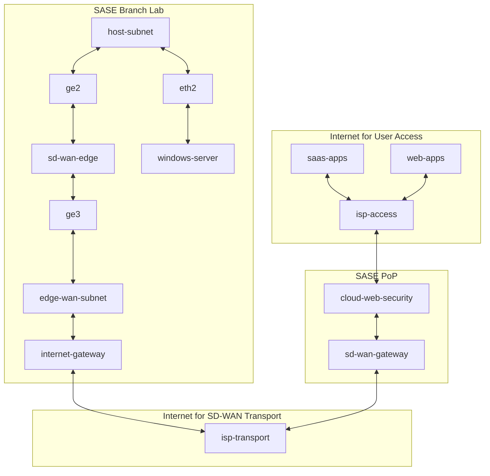
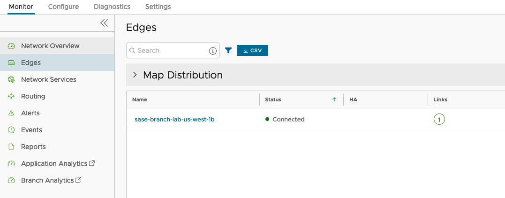
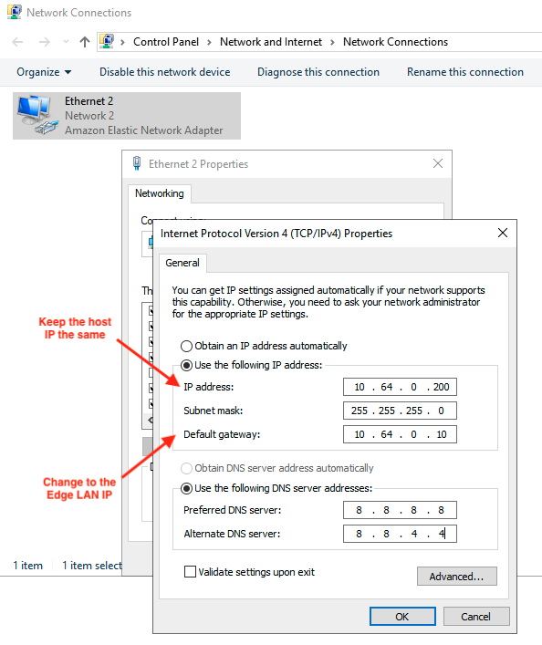
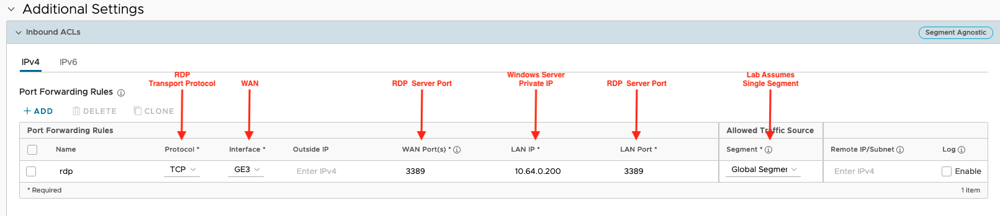
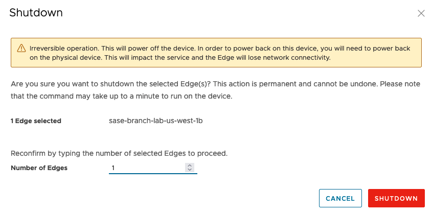
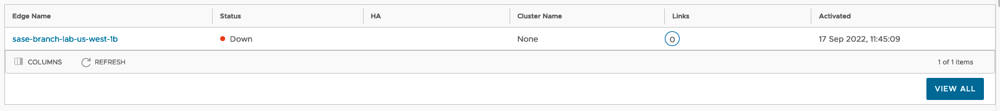

# vmware-sase-branch-lab

A disposable lab environment for testing VMware SD-WAN and Security functionality

## Table of Contents

- [Software Requirements](#software-requirements)
- [Topology](#topology)
- [After You Clone the Repository](#after-you-clone-the-repository)
- [Deploying the Lab](#deploying-the-lab)
- [Testing with the Lab](#testing-with-the-lab)
- [Destroying the Lab](#destroying-the-lab)

<a name="software-requirements"></a>

## Software Requirements

- [AWS](https://aws.amazon.com/)
- [Terraform CLI](https://learn.hashicorp.com/tutorials/terraform/install-cli)
- [VMware SD-WAN](https://docs.vmware.com/en/VMware-SD-WAN/index.html)
- [VMware Cloud Web Security](https://docs.vmware.com/en/VMware-Cloud-Web-Security/index.html)

This repository was built and tested on Ubuntu Server 22.04 LTS.

<a name="topology"></a>

## Topology



<a name="after-you-clone-the-repository"></a>

## After You Clone the Repository

### Add the terraform.tfvars file

The .gitignore file excludes .tfvars files. If you are running this code locally, you will need a. tfvars file to provide the necessary API keys for AWS and VMware Orchestrator as well as point to the Orchestrator you plan to use for testing. An example of what you will need to create and put in the root directory is shown below. Alternatively, you can use a remote (Terraform Cloud) for securely storing sensitive information without risking accidental exposure in your repository.

```shell
$ pwd
../vmware-sase-branch-lab

$ touch terraform.tfvars
$ ls | grep terraform.tfvars
$ sudo vim terraform.tfvars

# copy and paste contents with your specific values into terraform.tfvars file

aws_access_key = "<AWS_ACCESS_KEY>"
aws_secret_key = "<AWS_SECRET_KEY>"
vco_address    = "https://<VCO_URL>/portal/rest/"
vco_url        = "<VCO_URL>"
vco_username   = "<VCO_USERNAME>"
vco_password   = "<VCO_PASSWORD>"
edge_profile   = "<EDGE_PROFILE>"

# save and exit the file editor
```

### Add the VMware SASE Root Certificate

This is necessary for testing SSL Inspection with Cloud Web Security. This will prevent certificate errors on the clients when browsing or connecting to websites on the Internet. Instructions on retrieving the root certificate can be found [here]( https://docs.vmware.com/en/VMware-Cloud-Web-Security/5.0/VMware-Cloud-Web-Security-Configuration-Guide/GUID-A48C9642-A96C-4CC5-90E9-7C5490378661.html#ssl-inspection-category-5). Just do a quick search for “root” in the browser and you should find the instructions on how to retrieve the certificate.

```shell
$ cd clients
$ pwd
../vmware-sase-branch-lab/clients

$ touch vmware_sase_root.cer
$ ls | grep vmware_sase_root
$ sudo vim vmware_sase_root

# copy and paste the pem encoded root certificate into the file

-----BEGIN CERTIFICATE-----
<OUTPUT OMITTED FOR SECURITY>
-----END CERTIFICATE-----

# save and exit the file editor, return to main directory

$ cd ..
```

<a name="deploying-the-lab"></a>

## Deploying the Lab

1. Initialize the working directory

```shell
$ pwd

../vmware-sase-branch-lab

$ terraform init

Initializing modules...
- aws-us-west-1 in clients

<OUTUT OMITTED FOR BREVITY>

Terraform has been successfully initialized!

You may now begin working with Terraform. Try running "terraform plan" to see
any changes that are required for your infrastructure. All Terraform commands
should now work.
```

2. Run a plan and review the output

```shell
$ terraform plan

<OUTUT OMITTED FOR BREVITY>

Plan: 22 to add, 0 to change, 0 to destroy.

Changes to Outputs:
  + us_west_1_edge_public_ip    = (known after apply)
  + us_west_1_windows_public_ip = (known after apply)
```

3. Apply

```shell
$ terraform apply

<OUTPUT OMITTED FOR BREVITY>

  Enter a value: yes

<OUTPUT OMITTED FOR BREVITY>

Apply complete! Resources: 22 added, 0 changed, 0 destroyed.

Outputs:

us_west_1_edge_public_ip = "192.0.2.122"
us_west_1_windows_public_ip = "192.0.2.30"
```

### VMware SD-WAN Edge

The Edge will be deployed in AWS with whichever image it discovers for the AMI details provided in clients/main.tf. Most likely your Edge will pull down a new image and upgrade. This may take 5-10 minutes before your Edge is operational. You can monitor the Edge status from the Orchestrator. When the Edge is fully operational it should show up similar to what is shown below.



### Windows Server

The Windows Server requires a bit more effort to get into a desired state. The trick is to set its default gateway to point to the SD-WAN Edge LAN IP Addresses and use port forwarding on the SD-WAN Edge to retain RDP access to the server.

1. First retrieve the Windows Server password from the AWS Console using the contents found in the private key file: 'vmware-sase-branch-lab.pem'.

2. Open up an RDP session to the public IP address for the Windows Server provided in 'terraform output'.

```shell
Outputs:

us_west_1_windows_public_ip = "192.0.2.30"
```

3. Change the Ethernet adapter to use a static IP address and change the default gateway. You will lose the RDP session after you make this change. Don't worry! We'll fix this next.



4. Add a port forwarding rule for 3389 on the SD-WAN Edge under 'Configure > Edges > sase-branch-lab-us-west-1b > Firewall > Additional Settings > Inbound ACLs' in the Orchestrator.



5. Retrieve the public IP address of the Edge and update your RDP information to use this IP address.

```shell
$ terraform output
us_west_1_edge_public_ip = "192.0.2.122"
```

<a name="testing-with-the-lab"></a>

## Testing with the Lab

Once the lab is operational you should be able to perform any testing you would like to understand how VMware SASE works and the effect certain configuration changes have on the system.

For example, if you are testing [Cloud Web Security](https://www.youtube.com/watch?v=xzhaFRwrcus) you should immediately notice the browser prompts you for SSO (if you have an IdP configured) and/or when viewing the certificate on a website you see the SASE CWS Root CA in the certificate chain.

<a name="destroying-the-lab"></a>

## Destroying the Lab

 Cloud costs can be expensive, and it is prudent to not leave a lab running any longer than you need it. And with how quickly this lab can be (re)built, there is no reason to leave it in perpetuity. However, if you do not want to deal with the Windows server setup again you can shut down the EC2 instances until needed again. 

 1. Shutdown the Edge from Orchestrator by navigating to 'Diagnostics > Remote Actions > sase-branch-lab-us-west-1b > SHUTDOWN'.

 

This step is necessary because the VeloCloud Terraform Provider will not be able to remove the Edge if it is in a connected state. Be sure to wait until the Edge shows "Down" before moving onto the next step. This shouldn't take long.



2. Run terraform destroy

```shell
$ terraform destroy

<OUTPUT OMITTED FOR BREVITY>

  Enter a value: yes

<OUTPUT OMITTED FOR BREVITY>

Destroy complete! Resources: 22 destroyed.
```

That's it. All the components in AWS and Orchestrator have been removed.